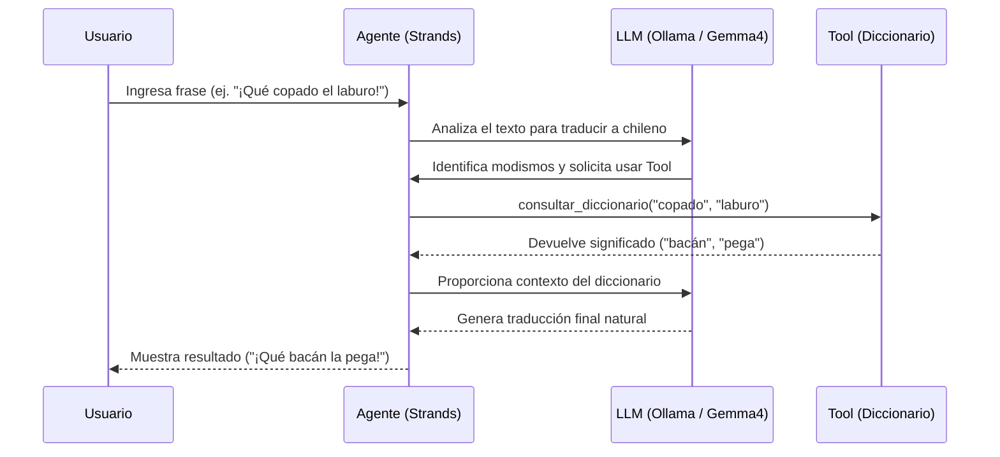

# Traductor Argentino-Chileno (Strands Agents + Ollama)

Este proyecto es un agente inteligente desarrollado con **Strands Agents** que utiliza el modelo **Gemma 4** (vía Ollama) para traducir frases con modismos argentinos a español chileno natural.

## ¿Cómo funciona?

El agente recibe una frase en español argentino y, mediante el uso del LLM, busca su equivalente más natural en español chileno. Para lograr mayor precisión con el argot específico, el agente utiliza una **Tool (Herramienta)** dedicada.

### La Tool del Diccionario

Una parte fundamental de este agente es el uso de la tool `consultar_diccionario`. Esta herramienta se encarga de leer el texto y consultar un archivo diccionario (`diccionario_arg_chi.json`) que contiene las traducciones exactas de un español al otro. El modelo de lenguaje decide cuándo y cómo utilizar esta tool para obtener el significado de los modismos antes de generar su respuesta final.

### Diagrama de Secuencia

A continuación se muestra el flujo de interacción entre el Usuario, el Agente, el Modelo y la Tool:



## Requisitos Previos

- Python 3.11 o superior.
- Acceso a un servidor de **Ollama** con el modelo `gemma4` descargado.

## Instalación

Para preparar el entorno virtual e instalar las dependencias necesarias, simplemente ejecuta:

```bash
make setup
```

## Configuración y Uso

El script utiliza variables de entorno para conectarse al servidor de Ollama. Puedes ejecutarlos con los valores por defecto (localhost y gemma4) o especificar un servidor remoto.

### Ejecución estándar:

```bash
make run
```

### Ejecución con servidor remoto:

```bash
make run OLLAMA_HOST="http://TU_HERMOSA_IP:11434" OLLAMA_MODEL="gemma4:latest"
```

## Diccionario

Puedes modificar el archivo `diccionario_arg_chi.json` para agregar nuevos modismos o ajustar las traducciones. El agente consultará este archivo antes de generar la respuesta final.

```json
{
  "che": "oye",
  "copado": "bacán",
  "laburo": "pega",
  "quilombo": "cacho"
}
```

## Frases para probar

Unas frases para hacer un testing:

- "Che, el laburo con los CI/CD pipelines de hoy fue un quilombo."
- "Ese chabón se gastó toda la guita en unas zapatillas nuevas."
- "El pibe se tomó el bondi equivocado para ir al centro."
- "Boludo, la automatización que armaste quedó re copada."

## Limpieza

Para eliminar el entorno virtual y los archivos generados:

```bash
make clean
```
